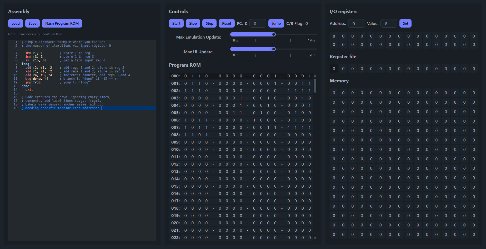

[source]
----
    ___       ___       ___       ___       ___
   /\  \     /\  \     /\  \     /\__\     /\  \
  /::\  \   /::\  \   _\:\  \   /:/  /    /::\  \
 /::\:\__\ /::\:\__\ /\/::\__\ /:/__/    /\:\:\__\
 \;:::/  / \/\::/  / \::/\/__/ \:\  \    \:\:\/__/
  |:\/__/    /:/  /   \:\__\    \:\__\    \::/  /
   \|__|     \/__/     \/__/     \/__/     \/__/
----
Rails is an https://en.wikipedia.org/wiki/Instruction_set_architecture[ISA]
 I designed for minimal implementation complexity while still being practically
 capable of general computation and being 3 operand. There are 16 instructions
 plus 4 pseudo instructions. Each instruction is 16 bits and there are 2 
encoding formats. The instruction set was heavily inspired by 
https://user.eng.umd.edu/~blj/RiSC/[RiSC 16], developed and used by Bruce Jacob 
at University of Maryland. RiSC 16 itself is a derivative of the Little Computer 
(LC-896) developed by Peter Chen at the University of Michigan.

<<Section1,Getting Started>> | <<Section2,ISA>>

== Getting Started [[Section1]]

1. Download The Emulator - Get the latest https://github.com/Data-Corruption/Rails/releases/latest[release] from this repo and unzip it.
2. Launch The Emulator - Run the exe, then click the link it provides to open it in your browser.
3. Create a Program - Using the emulator, write a program. See https://github.com/Data-Corruption/Rails/tree/main/assembly_examples[examples] for guidance.

== ISA [[Section2]]

.Instruction Binary Encoding
|====
|*Type* 4+^|*Format*
|3 Operand |Op Code 4 bit |A operand 4 bit |B operand 4 bit |C operand 4 bit 
|Immediate |Op Code 4 bit 2+^|Immediate 8 bit |C operand 4 bit
|====
.Syntax Legend
[cols="~,90"]
|====
|rX |This is an abbreviation for “register”, so r15 is just short for “register 15”.
|RAM[rX] |This means you are using the contents of rX as an address for indexing RAM.
|(last c-out) |The previous operation carry out.
|====
.Instructions
[cols="~,~,~,~,~"]
|====
|*Name* |*Opcode* |*Bin Encoding* |*Assembly* |*Description*
|ADD |0000|3 Operand|ADD rC rA rB |C = A + B
|ADDC|0001|3 Operand|ADDC rC rA rB|C = A + B + (last c-out)
|SUB |0010|3 Operand|SUB rC rA rB |C = A - B
|SWB |0011|3 Operand|SWB rC rA rB |C = A - B - (last c-out)
|NAND|0100|3 Operand|NAND rC rA rB|C = A NAND B
|RSFT|0101|3 Operand|RSFT rC rA   |C = Logical right shift A
|IMM |0110|Immediate|IMM rC IMM   |C = Immediate
|LD  |0111|3 Operand|LD rC rA     |C = RAM[rA]
|LDIM|1000|Immediate|LDIM rC IMM  |C = RAM[IMM]
|ST  |1001|3 Operand|ST rA rB     |RAM[rA] = B
|STIM|1010|Immediate|STIM IMM rC  |RAM[IMM] = C
|BEQ |1011|Immediate|BEQ IMM rC   |PC = IMM if r15 equals C
|BGT |1100|Immediate|BGT IMM rC   |PC = IMM if r15 > C
|JMPL|1101|3 Operand|JMPL rC rA   |C = PC + 1, then PC = A
|IN  |1110|3 Operand|IN rC rA     |C = i/o port A
|OUT |1111|3 Operand|OUT rA rB    |i/o port A = B
|====
.Pseudo Instructions
[cols="~,80"]
|====
|*Assembly* |*Description*
|NOP      |This operation does nothing and is replaced by ADD r0, r0, r0
|MOV rX rY|This copies data from rX to rY. It is replaced by ADD rX, r0, rY
|JMP IMM  |This jumps to IMM. It is replaced by BEQ IMM r15. The IMM like the rest, can be a line tag.
|EXIT     |This stops the cpu from running. It is replaced + by JMPL r0, r0.
|====
.Memory
[cols="~,80"]
|====
|Register File a|The register file is 16 bytes of dual read registers.

* Register 0 is a constant 0. Writing to address 0 results in nothing being saved. Reading from it will always be 0.
* Register 15 will always be used in branch instructions with C
|Input/Output Ports |16 ports you can read / write to. The ports do not feed back into themselves, Each port actually has two registers, one for the in and one for the out.
|Data Storage |Data storage is 256 bytes of RAM.
|Instruction Storage |Since the Program Counter is 8 bit (256 addresses) and instructions are 16 bit (2 bytes each), this means the instruction memory will be 512 bytes of ROM.
|====
